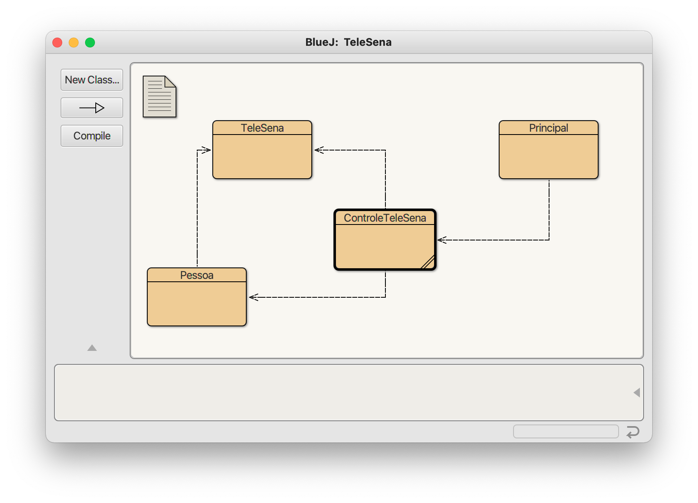
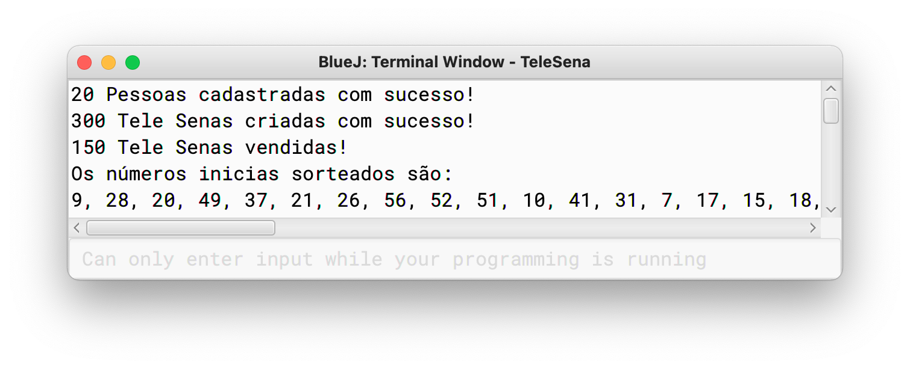
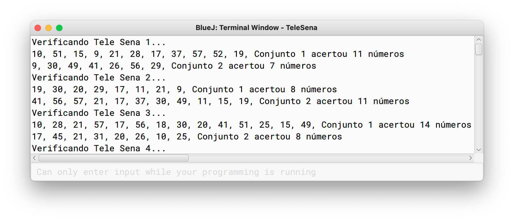
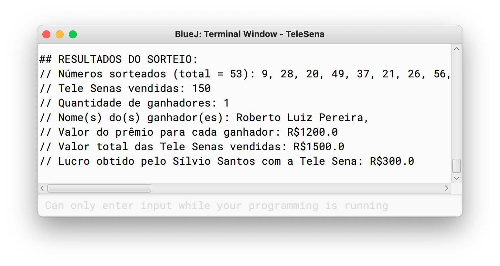

<h1 align="center">Sorteio da Tele Sena</h1>

Projeto de um sistema de sorteio da Tele Sena. Objetivo é praticar Loops com Arrays de Objetos da linguagem de programação Java.

---

Tabela de conteúdos
=================
<!--ts-->
   * [Tecnologias](#-technologies)
   * [Funcionalidades](#-features)
   * [Layout](#-layout)
   * [Como baixar e executar o projeto](#-how-to-download-and-execute-the-project)
<!--te-->

---

## Tecnologias <a name="-technologies" style="text-decoration:none"></a>
* [Java](https://www.java.com/pt-BR/)

---

## Funcionalidades <a name="-features" style="text-decoration:none"></a>

- [x] Cria informações das pessoas que vão competir de forma aleatória
- [x] Cria 2 conjuntos de 25 números em cada Tele Sena aleatoriamente e sem repetição
- [x] Distribui as Tele Senas entre as pessoas
- [x] Realiza sorteio dos 25 números iniciais e, caso não tenha ganhador, sorteia +1 número até ter um ganhador, sempre verificando as cartelas de todos participantes
- [x] Apresenta os resultados finais do sorteio

---

## Layout <a name="-layout" style="text-decoration:none"></a>

### Classes do projeto


### Início


### Verificações


### Resultado


---

## Como baixar e executar o projeto <a name="-how-to-download-and-execute-the-project" style="text-decoration:none"></a>

Antes de começar, você vai precisar ter instalado em seu computador as seguintes ferramentas: [Java](https://www.java.com/pt-BR/) e [BlueJ](https://bluej.org/).

```bash
# 1) Em uma janela de terminal/cmd, clone este repositório
$ git clone https://github.com/ecanali/coding-exercises.git

# 2) Acesse a pasta do projeto pelo terminal/cmd
$ cd coding-exercises/java/TeleSena

# 3) Abra o arquivo package.bluej com o BlueJ
$ open package.bluej

# 4) Clique no botão "Compile" no menu esquerdo do BlueJ

# 5) Clique com o botão direito em cima do "quadrado" Principal e selecione a opção void main(String[] args) e dê OK

```

Made with ♥ by Erick Canali :wave: